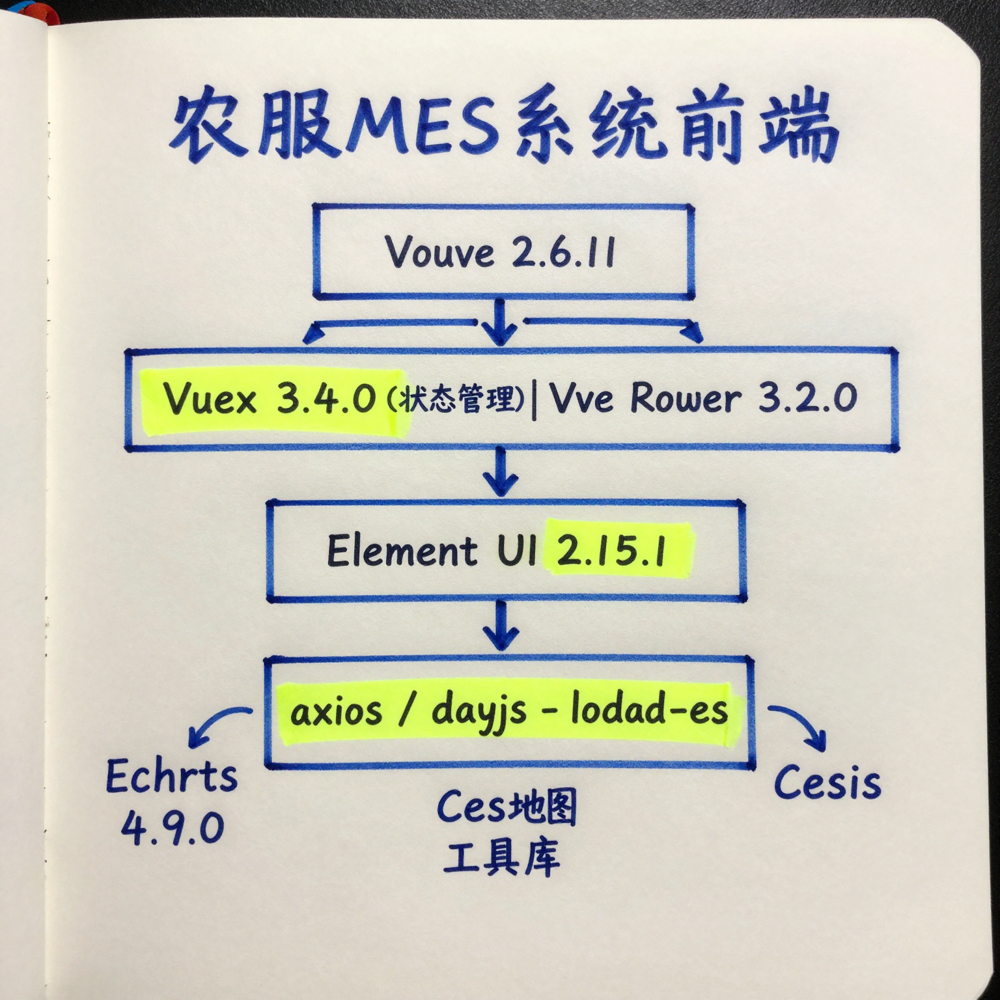
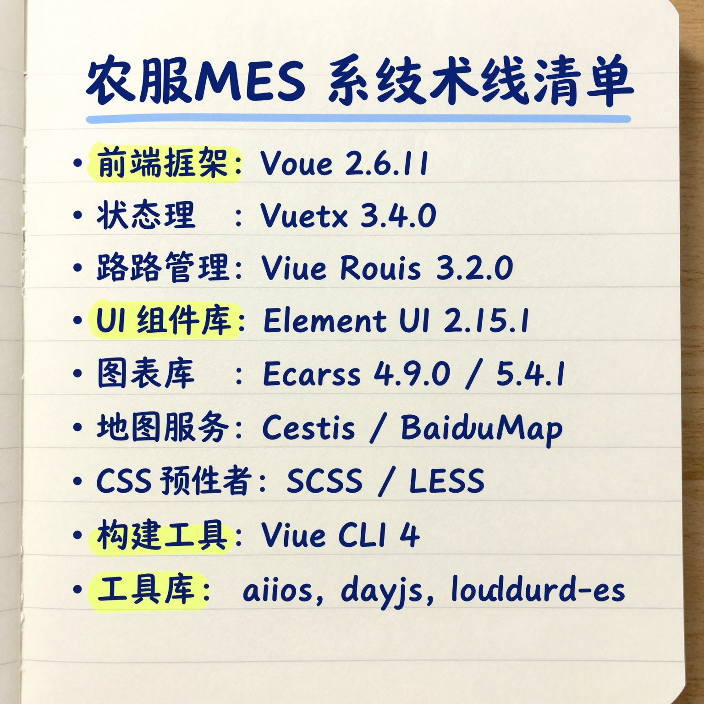
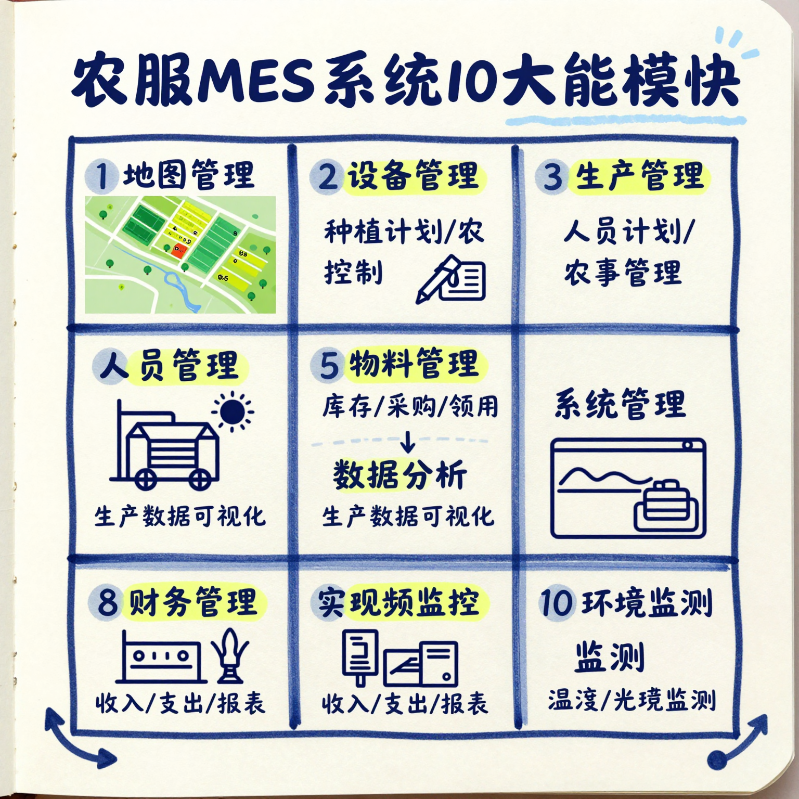
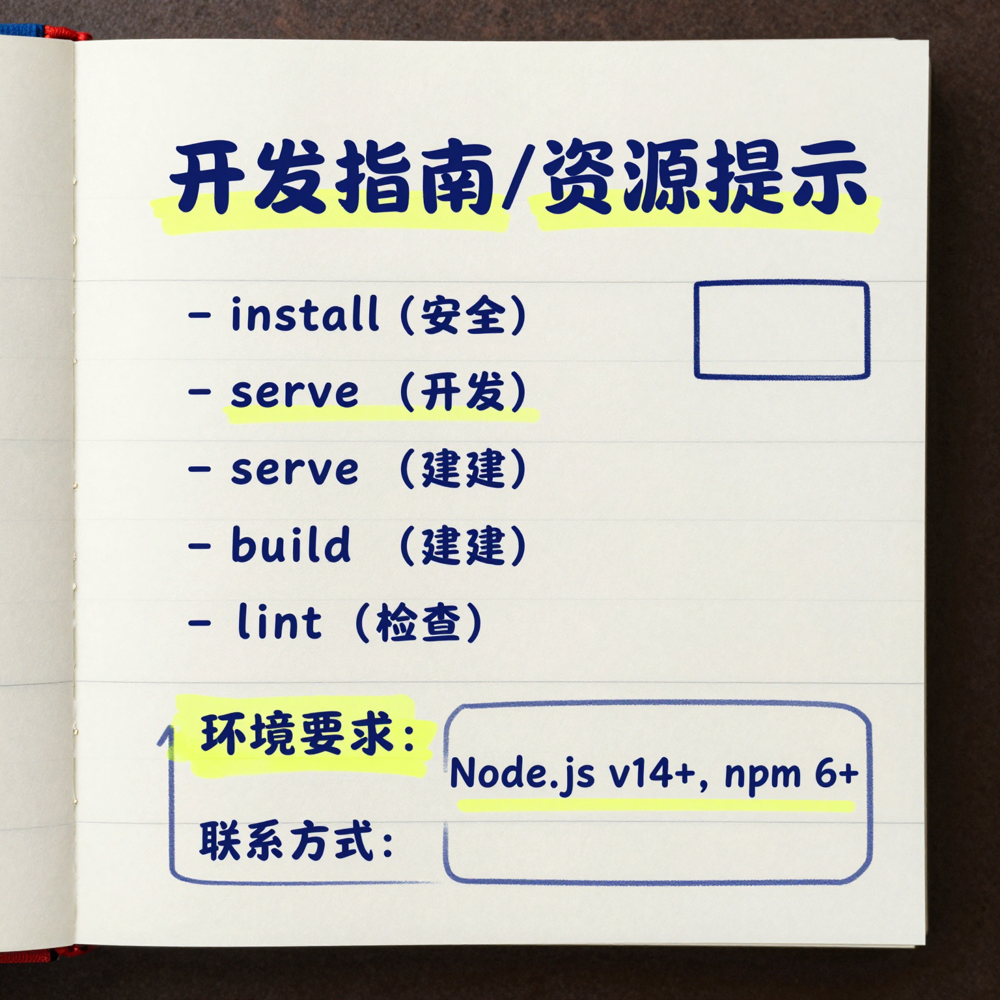

# 农服 MES 系统 - 小红书图片系列

> 前端开发者的农业数字化实践 - 技术分享笔记

---

## 📖 内容概述

这是一套关于**农服 MES 系统**的技术分享笔记，采用小红书风格的学习笔记形式呈现。内容涵盖系统架构、技术栈、功能模块和开发指南。

---

## 🖼️ 图片预览

### P1 - 封面

**主题**: 用代码种地 - 前端开发者的农业数字化实践

---

### P2 - 系统架构图

**内容**: 前端技术架构层次图
- Vue 2.6.11 (应用层)
- Vuex 3.4.0 + Vue Router 3.2.0 (状态管理/路由)
- Element UI 2.15.1 (UI 组件)
- axios / dayjs / lodash-es (工具库)

---

### P3 - 技术栈清单

**内容**: 完整技术栈列表
| 类型 | 技术 |
|------|------|
| 前端框架 | Vue 2.6.11 |
| 状态管理 | Vuex 3.4.0 |
| 路由管理 | Vue Router 3.2.0 |
| UI 组件库 | Element UI 2.15.1 |
| 图表库 | ECharts 4.9.0 / 5.4.1 |
| 地图服务 | Cesium / BaiduMap |
| CSS 预处理器 | SCSS / LESS |
| 构建工具 | Vue CLI 4 |

---

### P4 - 功能模块矩阵

**内容**: 10 大核心功能模块
1. 地图管理 - 农场/区域/地块空间管理
2. 设备管理 - 设备监控和控制
3. 生产管理 - 种植计划/农事管理
4. 人员管理 - 考勤/薪资管理
5. 物料管理 - 库存/采购/领用
6. 数据分析 - 生产数据可视化
7. 系统管理 - 用户/权限/日志
8. 财务管理 - 收入/支出/报表
9. 视频监控 - 实时视频监控
10. 环境监测 - 温湿度/光照监测

---

### P5 - 开发指南

**内容**: 快速开始命令

```bash
# 安装依赖
npm install

# 启动开发服务器
npm run serve

# 构建生产版本
npm run build

# 代码检查
npm run lint
```

**环境要求**:
- Node.js: v14.15.0+
- npm: 6.14.0+

---

## 📊 系统信息

| 项目 | 说明 |
|------|------|
| 项目名称 | 农服 MES 系统 (wmynf_mes) |
| 技术栈 | Vue 2.x + Element UI |
| 应用类型 | 农业生产管理数字化平台 |
| 图片风格 | study-notes (真实笔记风) |
| 图片数量 | 5 张 |

---

## 🎨 图片风格说明

本系列图片采用 **study-notes** 风格：
- 背景：笔记本纸张纹理
- 文字：蓝笔手写体
- 强调：黄色荧光笔标注
- 装饰：手绘箭头、下划线、圆圈

适合技术分享、教程笔记、学习笔记等内容场景。

---

## 📁 文件结构

```
image-create/
├── 01-cover-nf-mes.png          # 封面图
├── 02-architecture-nf-mes.png   # 系统架构图
├── 03-techstack-nf-mes.png      # 技术栈清单
├── 04-features-nf-mes.png       # 功能模块矩阵
├── 05-resources-nf-mes.png      # 开发指南
└── README.md                    # 本文件
```

---

## 🔗 相关链接

- [项目源码](https://github.com/wenshunxin/wmynf_mes) (如有)
- [Vue.js 官方文档](https://cn.vuejs.org/)
- [Element UI](https://element.eleme.cn/)
- [ECharts](https://echarts.apache.org/)

---

## 📝 使用说明

本系列图片可用于：
- 小红书技术分享笔记
- GitHub 项目文档配图
- 技术博客插图
- 内部分享演示

---

## ⚖️ 许可证

MIT License

---

## 📧 联系方式

- GitHub: [@wenshunxin](https://github.com/wenshunxin)
- Email: 872880818@qq.com

---

<p align="center">
  <strong>用代码种地 🌾 技术赋能农业</strong>
</p>
